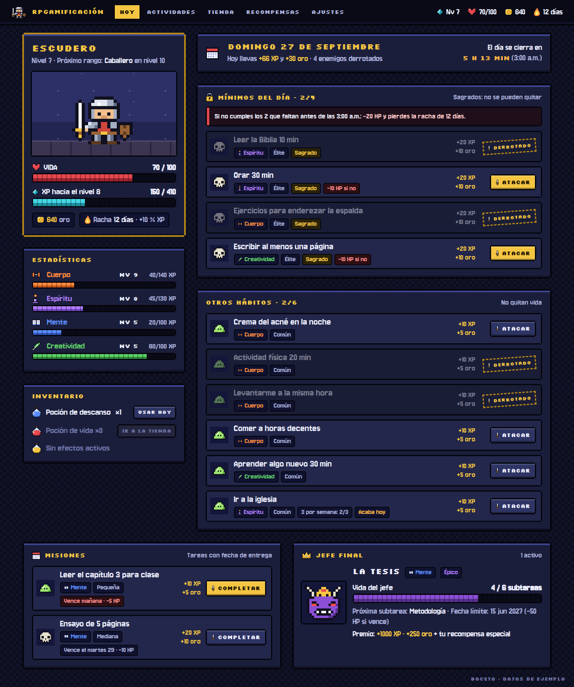
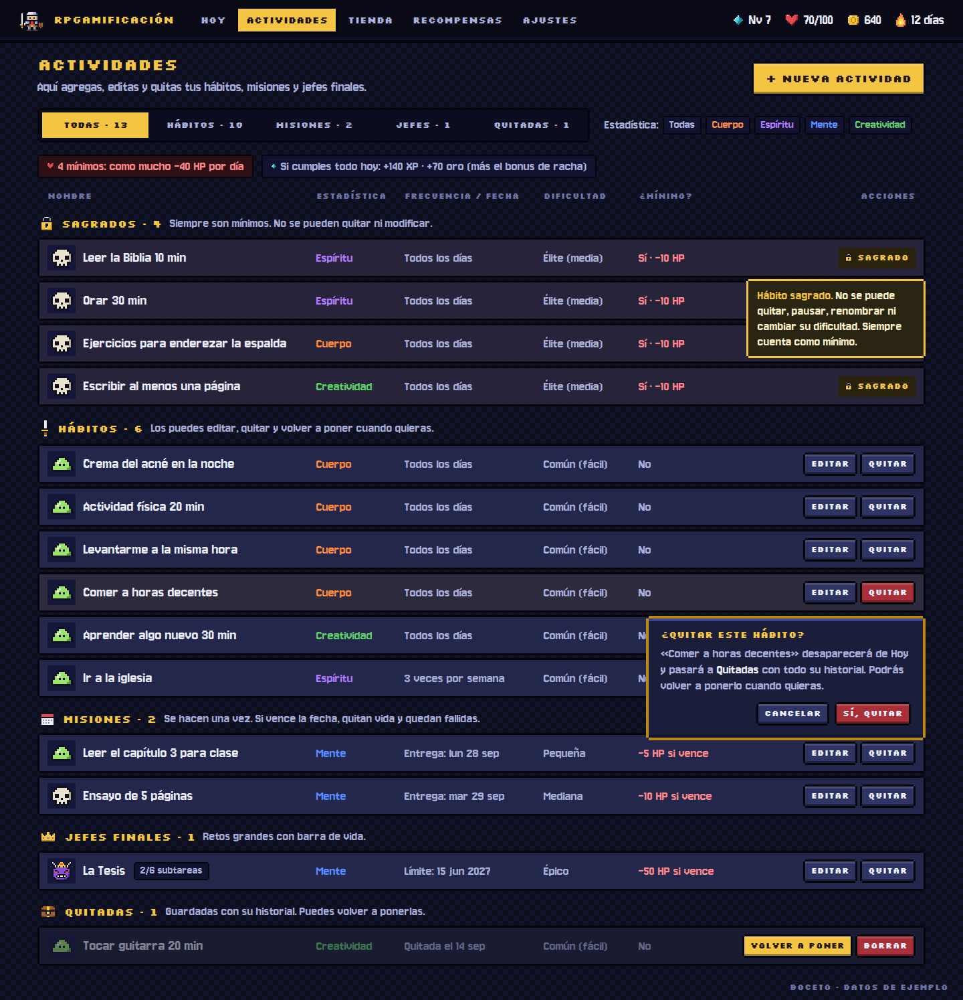
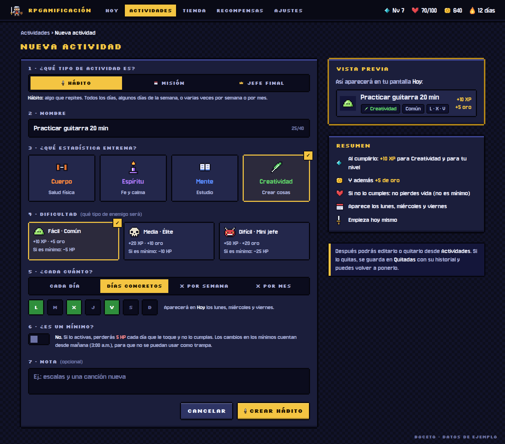
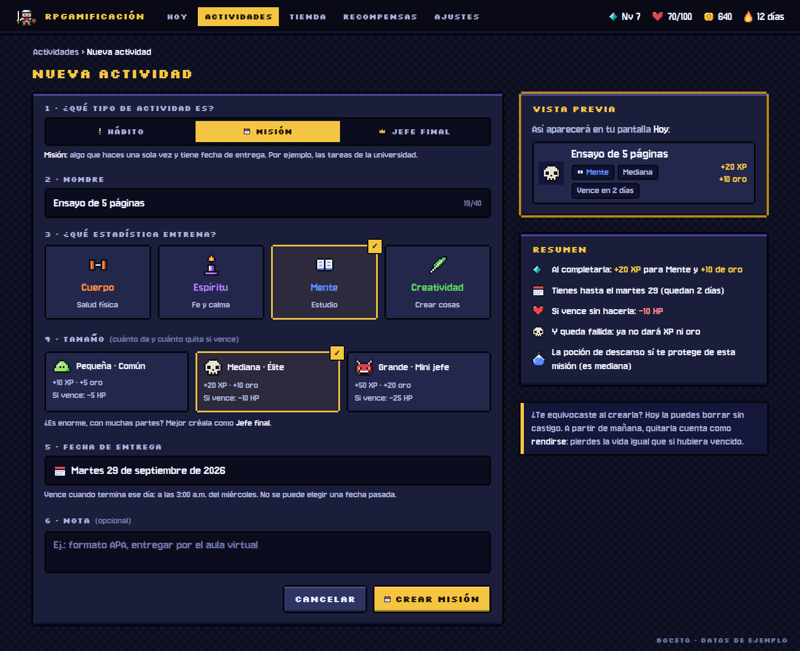
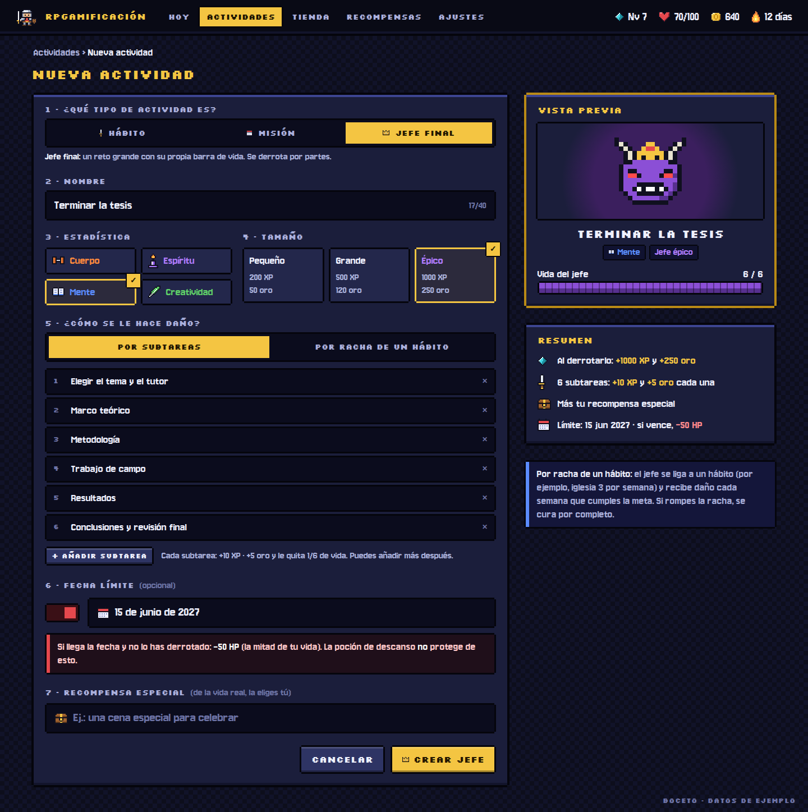
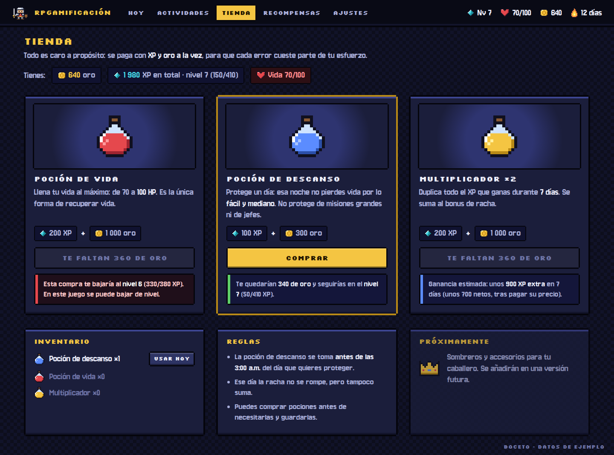
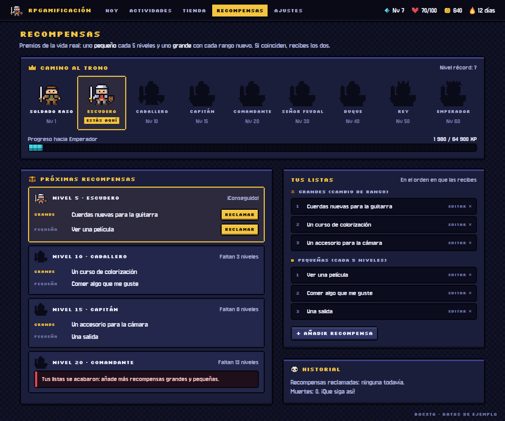

# Documento de diseño — RPG de hábitos

> **Estado:** v0.6 — **diseño cerrado**. Ya empezó la programación (ver `README.md`).
> Lo marcado con 🟡 son decisiones mías que se pueden ajustar al probar el juego.
>
> **Leyenda:**
> ✅ = decidido · 🟡 = propuesta (se puede cambiar) · ❓ = falta decidir

---

## 1. Concepto

✅ Un juego web de uso personal que convierte mis hábitos en un RPG. Mi
personaje es un **caballero en pixel art** que asciende, como en una película,
de **soldado raso a emperador** a medida que cumplo mis hábitos.

- Cumplir un hábito = **derrotar a un enemigo** y ganar XP y oro.
- Las misiones grandes son **jefes finales** con su propia barra de vida.
- Lo que no cumplo me **quita vida**. La vida **solo** se recupera con pociones caras.
- Si la vida llega a 0, **muero** y pierdo todo mi progreso.

✅ **Filosofía:** el juego debe presionar de verdad. No hay modo descanso ni
regeneración gratis: cada error se paga con el esfuerzo (XP y oro) que ya hice.

✅ Plataforma: **PC** (navegador). La versión para celular se verá más adelante.

---

## 2. El personaje

### 2.1 Rangos

✅ El aspecto del caballero cambia con cada rango (armadura, capa, corona, etc.).

✅ Rangos según el **nivel general**:

| Nivel   | Rango         | Tiempo aprox. para llegar (🟡) |
|---------|---------------|--------------------------------|
| 1–4     | Soldado raso  | inicio                         |
| 5–9     | Escudero      | ~1,5 semanas                   |
| 10–14   | Caballero     | ~3 semanas                     |
| 15–19   | Capitán       | ~5,5 semanas                   |
| 20–29   | Comandante    | ~2 meses                       |
| 30–39   | Señor feudal  | ~3,5 meses                     |
| 40–49   | Duque         | ~5,5 meses                     |
| 50–59   | Rey           | ~8 meses                       |
| 60+     | Emperador     | **~11 meses**                  |

Los tiempos salen de la fórmula de la sección 4. Suponen que cumplo más o menos
el 85 % de mis hábitos y que mantengo la racha de mínimos. Los jefes finales
acortan el camino, y comprar pociones lo alarga. Si subo la dificultad de mis
hábitos, también llegaré antes.

✅ Después del nivel 60 se puede seguir subiendo de nivel (el rango sigue siendo Emperador).

✅ Si bajo de nivel (ver 6.1) y caigo por debajo del mínimo de mi rango, **pierdo el rango** y el caballero vuelve a su aspecto anterior.

### 2.2 Aspecto (sprites)

✅ Para empezar, **sprites sencillos hechos con código**: un caballero en pixel art
dibujado con cuadraditos, con una variante por rango. Más adelante se pueden
cambiar por dibujos más elaborados.

✅ Sombreros y accesorios: se añaden **más adelante** (no en la primera versión).

### 2.3 Estadísticas

✅ 4 estadísticas: **Cuerpo, Espíritu, Mente, Creatividad**.

✅ Cada estadística tiene **su propio nivel y su propia barra de XP**, además del nivel general.

✅ Cuando gano XP en un hábito, ese XP cuenta **a la vez** para la estadística del hábito y para el nivel general.

🟡 Fórmula de nivel de estadística: pasar del nivel `N` al `N+1` cuesta `50 + 10 × N` XP.

---

## 3. Hábitos (enemigos)

### 3.1 Reglas generales

✅ Cada hábito está ligado a **una** estadística.

✅ Hay un **apartado de Actividades** donde puedo **agregar, editar, quitar y
volver a poner** hábitos, misiones y jefes (ver sección 11).

✅ Frecuencias posibles: **diaria**, **semanal** (X veces por semana) y **mensual** (X veces por mes).
✅ Además, **días concretos** de la semana (ejemplo: solo lunes, miércoles y viernes).
Si un hábito de días concretos es mínimo, solo quita vida los días que le tocan.

🟡 Cada vez que marco un hábito semanal o mensual recibo su XP. La cuenta
("iglesia: 2/3 esta semana") sirve para los jefes de racha (ver 3.5).

🟡 Cada hábito se marca **como mucho una vez al día**. Los semanales y mensuales
se pueden marcar hasta completar su meta del periodo (ejemplo: 3 de 3).

🟡 Puedo desmarcar un hábito el mismo día si lo marqué por error (se devuelven el XP y el oro).

### 3.2 Hábitos sagrados (no se pueden quitar)

✅ Hay **4 hábitos fijos** que **no se pueden borrar** por más que quiera. Además,
**son mis mínimos diarios**: si no los cumplo, cada uno me quita 10 HP.

| Hábito sagrado                     | Estadística  | Frecuencia | Dificultad |
|------------------------------------|--------------|------------|------------|
| Leer la Biblia 10 min              | Espíritu     | Diaria     | Media      |
| Orar 30 min                        | Espíritu     | Diaria     | Media      |
| Ejercicios para enderezar la espalda | Cuerpo     | Diaria     | Media      |
| Escribir al menos una página       | Creatividad  | Diaria     | Media      |

✅ En el apartado de actividades aparecen con un 🔒 candado. **No se pueden**
quitar (ni siquiera temporalmente), cambiar de dificultad, cambiar de frecuencia
ni dejar de ser mínimos. ✅ Tampoco se pueden renombrar.

*Nota:* como los datos están en mi propio navegador, técnicamente siempre podría
hacer trampa tocando el código. El candado es un **compromiso de honor**: el juego
no ofrece ninguna forma de quitarlos.

### 3.3 Dificultad = tipo de enemigo

✅

| Dificultad | Enemigo          | XP al cumplir | Oro al cumplir | Vida que pierdo si no lo cumplo* |
|------------|------------------|---------------|----------------|----------------------------------|
| Fácil      | Enemigo común    | 10            | 5              | −5 HP                            |
| Media      | Enemigo élite    | 20            | 10             | −10 HP                           |
| Difícil    | Mini jefe        | 50            | 20             | −25 HP                           |

\* Solo quitan vida los **mínimos diarios** y las **misiones vencidas** (ver 5.1).

### 3.4 Hábitos iniciales

✅ Lista inicial. Los **4 sagrados son de dificultad media**. Todos los demás
empiezan en **fácil**, y yo ajusto su dificultad desde el apartado de actividades.

| Hábito                               | Estadística  | Frecuencia         | Dificultad     | Mínimo | Sagrado |
|--------------------------------------|--------------|--------------------|----------------|--------|---------|
| Leer la Biblia 10 min                | Espíritu     | Diaria             | Media          | ✅ Sí  | 🔒      |
| Orar 30 min                          | Espíritu     | Diaria             | Media          | ✅ Sí  | 🔒      |
| Ejercicios para enderezar la espalda | Cuerpo       | Diaria             | Media          | ✅ Sí  | 🔒      |
| Escribir al menos una página         | Creatividad  | Diaria             | Media          | ✅ Sí  | 🔒      |
| Crema del acné en la noche           | Cuerpo       | Diaria             | Fácil          | No     |         |
| Actividad física 20 min              | Cuerpo       | Diaria             | Fácil          | No     |         |
| Levantarme a la misma hora           | Cuerpo       | Diaria             | Fácil          | No     |         |
| Comer a horas decentes               | Cuerpo       | Diaria             | Fácil          | No     |         |
| Ir a la iglesia                      | Espíritu     | 3 × semana         | Fácil          | No     |         |
| Aprender algo nuevo 30 min           | Creatividad  | Diaria             | Fácil          | No     |         |
| Tareas de la universidad             | Mente        | Misiones (ver 3.6) | Según la tarea | —      |         |

✅ Los **mínimos diarios** son configurables: puedo añadir más mínimos, pero los 4 sagrados siempre lo son.

✅ La crema del acné y la actividad física son **hábitos normales**: no son
sagrados ni mínimos, y se pueden quitar y volver a poner cuando quiera.

### 3.5 Jefes finales

✅ Misiones grandes con **su propia barra de vida**. Dan **mucha XP** y una **recompensa especial**.

✅ Hay dos tipos de jefe:

1. **Jefe por subtareas.** Divido la misión en subtareas. Cada subtarea completada le quita vida al jefe. Cuando todas están hechas, el jefe cae.
   - Ejemplos: *Terminar la tesis*, *Escribir el guion del cortometraje*.
2. **Jefe por racha.** Está ligado a un hábito. Recibe daño cada vez que cumplo la meta de ese hábito, y se **cura por completo** si rompo la racha.
   - Ejemplo: *Un mes de racha yendo a la iglesia* = 4 semanas seguidas cumpliendo 3/3.

✅ Cada jefe tiene una estadística y un tamaño:

| Tamaño  | XP al derrotarlo | Oro | Ejemplo            |
|---------|------------------|-----|--------------------|
| Pequeño | 200              | 50  | Un mes de iglesia  |
| Grande  | 500              | 120 | Guion del corto    |
| Épico   | 1000             | 250 | La tesis           |

✅ Cada subtarea da además el XP y el oro de un enemigo común (10 XP, 5 de oro).

✅ La **recompensa especial** de cada jefe la escribo yo al crearlo.

✅ Un jefe puede tener **fecha límite** (opcional). Si vence sin derrotarlo, pierdo **la mitad de la vida** (ver 5.1).

### 3.6 Misiones de la universidad (Mente)

✅ Las tareas de la universidad son **misiones con fecha de entrega**. Al crear una
misión elijo su tamaño (pequeña / mediana / grande = común / élite / mini jefe).
Si es muy grande, la convierto en jefe final.

✅ Si la fecha de entrega pasa sin completarla, **pierdo vida según su tamaño** (ver 5.1).

✅ Después de vencer, la misión queda marcada como **"fallida"** y se cierra:
**ya no da XP ni oro**. Si no lo hice a tiempo, no lo hice.

🟡 Lo mismo pasa con un jefe con fecha límite vencida: queda "fallido" y no da su
recompensa. Las subtareas que ya hice conservan el XP que dieron en su momento.

---

## 4. Experiencia (XP) y nivel general

✅ Todo el XP ganado (de cualquier estadística) suma al nivel general.

🟡 Fórmula: pasar del nivel `N` al `N+1` cuesta **`200 + 30 × N` XP**.
Está ajustada para que llegar a Emperador (nivel 60) tome más o menos un año.

| Nivel | XP para el siguiente | XP total acumulado para llegar |
|-------|----------------------|--------------------------------|
| 1     | 230                  | 0                              |
| 5     | 350                  | 1 100                          |
| 10    | 500                  | 3 150                          |
| 20    | 800                  | 9 500                          |
| 30    | 1 100                | 18 850                         |
| 40    | 1 400                | 31 200                         |
| 50    | 1 700                | 46 550                         |
| 60    | 2 000                | 64 900                         |

*Cálculo:* con los hábitos iniciales (sagrados medios, el resto fáciles), un día
perfecto da unos 155 XP y unos 77 de oro. Cumpliendo el ~85 % son unos 130 XP y
65 de oro al día. Con el bonus máximo de racha (+50 %) se llega a unos 195 XP.
Eso da ~11 meses hasta el nivel 60. Si subo dificultades, el ritmo se acelera: lo
revisamos tras unas semanas de juego.

✅ Si gasto XP en la tienda, **puedo bajar de nivel** (ver 6.1).

---

## 5. Vida (HP)

✅ Vida máxima: **100 HP**.

✅ La vida **no se recupera sola**, solo con la **poción de vida** (ver 6.1).

✅ **No hay modo descanso.** Si un día estoy enfermo o mal, el daño se paga con
pociones. La única protección es la **poción de descanso**, que se compra (ver 6.2).

✅ **Reinicio del día: 3:00 a.m.** Lo que marque entre las 00:00 y las 02:59 cuenta para el día anterior.

### 5.1 Qué quita vida

✅ Pierdo vida por cada cosa que no complete, **según su tamaño**:

| Qué no cumplí                          | Cuándo se aplica            | Daño                       |
|----------------------------------------|-----------------------------|----------------------------|
| Mínimo diario fácil                    | Reinicio de las 3:00 a.m.   | −5 HP                      |
| Mínimo diario medio                    | Reinicio de las 3:00 a.m.   | −10 HP                     |
| Mínimo diario difícil                  | Reinicio de las 3:00 a.m.   | −25 HP                     |
| Misión pequeña vencida                 | Al pasar la fecha de entrega | −5 HP                     |
| Misión mediana vencida                 | Al pasar la fecha de entrega | −10 HP                    |
| Misión grande vencida                  | Al pasar la fecha de entrega | −25 HP                    |
| Jefe final con fecha límite vencida    | Al pasar la fecha límite    | −50 HP (la mitad de la vida) |

✅ Los hábitos que **no** son mínimos no quitan vida (solo dejan de dar XP y oro).

**Ejemplo:** mis mínimos son los 4 sagrados, todos medios. Un día sin cumplir
ninguno quita **40 HP**: con dos días así quedo a 20 HP, y al tercero muero.

---

## 6. Tienda

✅ Todo en la tienda es **caro a propósito**: se paga con **XP y oro a la vez**,
para que cada error cueste parte del esfuerzo ya hecho.

| Objeto                   | Efecto                                              | Precio                  |
|--------------------------|-----------------------------------------------------|-------------------------|
| **Poción de vida**       | Llena la vida al **máximo** (100 HP)                | **200 XP + 1 000 oro**  |
| **Poción de descanso**   | Ese día no pierdo vida por lo **fácil y mediano** (ver 6.2) | **100 XP + 300 oro** |
| **Multiplicador de XP**  | **×2 XP durante 7 días**                            | **200 XP + 1 000 oro**  |

Con unos 65 de oro al día, una poción de vida cuesta **~15 días de oro**, una de
descanso **~4,5 días** y un multiplicador **~15 días**.

### 6.1 Poción de vida y bajar de nivel

✅ El XP se resta del **XP total**, así que **puedo bajar de nivel**, e incluso de rango.

🟡 Para que esto no se pueda aprovechar mal:
- El XP se resta **solo del nivel general**. Los niveles de las estadísticas no bajan, porque reflejan lo que realmente hice.
- **Las recompensas reales se cobran una sola vez por nivel.** El juego guarda mi **nivel récord**. Si bajo del 31 al 29 y vuelvo a subir al 30, no me toca otra recompensa: solo al superar mi récord.
- No se puede comprar si no tengo suficiente XP y oro. (No existe XP negativo: el mínimo es nivel 1 con 0 XP).

### 6.2 Poción de descanso

✅ Protege un día del daño **fácil y mediano**: mínimos no cumplidos y misiones
pequeñas o medianas que venzan ese día.

✅ **No protege de lo difícil:** si ese día vence una misión grande (−25 HP) o un
jefe final (−50 HP), ese daño se aplica igual.

🟡 Reglas:
- Hay que **tomarla antes** del reinicio de las 3:00 a.m. del día que quiero proteger. No sirve para días que ya pasaron.
- La **racha no se rompe**, pero ese día tampoco suma a la racha (queda "congelada").
- Se pueden comprar por adelantado y guardar en el inventario.

### 6.3 Multiplicador de XP

✅ Duplica el XP ganado durante **7 días** (desde que lo activo). Cuesta 200 XP + 1 000 oro.
Con unos 130 XP diarios, da ~900 XP extra: una ganancia neta de ~700 XP.

🟡 No se pueden acumular dos a la vez: si activo otro, se suman los días, no el multiplicador.

🟡 Se combina multiplicando con el bonus de racha (ejemplo: racha +50 % × multiplicador ×2 = ×3).

### 6.4 Oro

✅ Se gana oro al derrotar enemigos (tabla 3.3) y jefes (tabla 3.5).
✅ El oro se usa para pociones, multiplicadores y, más adelante, sombreros y accesorios.

---

## 7. Rachas

✅ Una racha es la cantidad de **días seguidos cumpliendo todos los mínimos**.
✅ Da **+10 % de XP por cada 7 días** de racha, con un **tope de +50 %** (a partir de 35 días).
✅ La racha se rompe con **un solo** mínimo no cumplido, y el bonus vuelve a 0 %.
✅ Un día protegido con poción de descanso no rompe la racha, pero tampoco la aumenta.

---

## 8. Recompensas de la vida real

✅ **Pequeña** cada 5 niveles y **grande** con cada cambio de rango. Todas editables.

✅ **Cuando coinciden** (niveles 5, 10, 15, 20, 30, 40, 50 y 60): recibo **las dos**.

✅ Ejemplos iniciales:
- **Pequeñas:** ver una película, comer algo que me guste, una salida.
- **Grandes:** cuerdas nuevas para la guitarra, un curso de colorización, un accesorio para la cámara.

🟡 Funcionamiento: cada tipo de recompensa es una **lista ordenada** que edito en
la pantalla **Recompensas** (ver 12.7). Al llegar a un nivel récord, el juego me muestra la siguiente
de la lista y un botón **"Reclamar"** para marcar que ya me la di. Queda un
historial de recompensas cobradas.

🟡 Hay 8 cambios de rango y solo 3 recompensas grandes de ejemplo. Si una lista
se acaba, el juego me avisa para que añada más. La siguiente que añada ocupa el hueco.

🟡 Si muero en modo Hardcore, las recompensas que no había reclamado vuelven al
principio de su lista.

---

## 9. Muerte

✅ Si la vida llega a 0, **muero**.

✅ La penalización es **configurable** (en **Ajustes**). Por defecto es **Hardcore**:

| Modo              | Qué pierdo |
|-------------------|------------|
| **Hardcore** ✅ (por defecto) | **Todo**: nivel general, niveles de estadísticas, XP, oro, objetos, racha y nivel récord |
| Duro 🟡           | Vuelvo al inicio de mi rango actual y pierdo oro y objetos |
| Suave 🟡          | Pierdo la mitad del oro y los objetos, sin bajar de nivel |

🟡 Tras morir la vida vuelve a 100 HP. **No se borra** la configuración: hábitos
(incluidos los sagrados), mínimos, lista de recompensas y jefes, con las
subtareas que ya hice. Los jefes vuelven a dar su XP cuando los termine.

🟡 Como el nivel récord también se pierde, **las recompensas reales se pueden volver a ganar** después de morir.

🟡 Queda registrado un **historial de muertes** (fecha y nivel alcanzado), como en los juegos *roguelike*.

---

## 10. Aspectos técnicos

✅ Se juega en el navegador del PC.
✅ Personaje con sprites sencillos hechos con código.
🟡 HTML + CSS + JavaScript, sin servidor ni instalación.
🟡 Los datos se guardan en el navegador (`localStorage`).
🟡 **Exportar e importar una copia de seguridad** (un archivo `.json`). Si limpio los
datos del navegador, se borra la partida. Sería una "muerte" que no merecí.

🟡 **Días en que no abro el juego:** una página web solo funciona mientras está
abierta. Por eso, al abrirla, el juego revisa todos los reinicios de las 3:00 a.m.
y las fechas de entrega que pasaron desde la última vez, y aplica a cada uno el
daño y las rachas que correspondan.

---

## 11. Apartado de actividades

✅ Es la pantalla **Actividades** del menú. Aquí agrego, edito, quito y vuelvo a
poner todo lo que el juego me pide hacer.

### 11.1 Tres tipos de actividad

| Tipo           | Qué es                                            | Ejemplos                               | Dónde aparece |
|----------------|---------------------------------------------------|----------------------------------------|---------------|
| **Hábito**     | Algo que repito                                   | Orar 30 min, iglesia 3 veces por semana | En **Hoy**, cada día que le toque |
| **Misión**     | Algo que hago **una sola vez**, con fecha de entrega | Ensayo de la universidad            | En **Hoy**, hasta que la complete o venza |
| **Jefe final** | Reto grande con **barra de vida**                 | La tesis, el guion del corto           | En **Hoy**, sección de jefes |

### 11.2 La lista (imagen 2)

- Agrupada en: **Sagrados · Hábitos · Misiones · Jefes finales · Quitadas**.
- 🟡 Filtros por tipo y por estadística.
- Cada fila muestra: estadística, frecuencia o fecha, dificultad, si es mínimo y los botones **Editar** y **Quitar**.
- Arriba, un resumen: cuánta vida puedo perder como mucho en un día (−40 HP con los 4 mínimos actuales) y cuánto puedo ganar hoy.
- Los **sagrados** llevan 🔒 y no tienen botones.

### 11.3 Crear una actividad (imágenes 3, 4 y 5)

✅ Botón **"+ Nueva actividad"**. Primero elijo el tipo; el formulario cambia según el tipo.

| Campo                         | Hábito                                    | Misión                    | Jefe final                  |
|-------------------------------|-------------------------------------------|---------------------------|-----------------------------|
| Nombre (máx. 40 letras)       | ✅                                        | ✅                        | ✅                          |
| Estadística                   | ✅                                        | ✅                        | ✅                          |
| Dificultad o tamaño           | Fácil / Media / Difícil                   | Pequeña / Mediana / Grande | Pequeño / Grande / Épico   |
| Frecuencia                    | Cada día · días concretos · X por semana · X por mes | —              | —                           |
| ¿Es mínimo?                   | ✅ (solo si es diario o de días concretos) | —                        | —                           |
| Fecha                         | —                                         | Fecha de entrega (obligatoria) | Fecha límite (opcional) |
| Cómo se le hace daño          | —                                         | —                         | Subtareas o racha de un hábito |
| Recompensa especial           | —                                         | —                         | ✅                          |
| Nota                          | opcional                                  | opcional                  | —                           |

- 🟡 **Vista previa en vivo:** a la derecha se ve cómo quedará en la pantalla Hoy, y un resumen de lo que gano y lo que arriesgo.
- 🟡 **Valores por defecto:** dificultad fácil y "no es mínimo". Así, lo nuevo nunca castiga sin que yo lo decida.
- 🟡 **Validaciones:** el nombre es obligatorio y no se puede repetir; la fecha de entrega no puede ser pasada; un jefe por subtareas necesita al menos 2 subtareas, y un jefe por racha necesita un hábito ligado.
- 🟡 Un hábito nuevo aparece en Hoy **ese mismo día** (si le toca).

### 11.4 Editar

- Se puede cambiar todo **menos el tipo** (si un hábito debía ser misión, se crea de nuevo).
- ✅ **Regla anti-trampa:** los cambios que afectan a la vida (dificultad, frecuencia, marcar o desmarcar como mínimo) **se aplican desde el siguiente reinicio (3:00 a.m.)**. Así no puedo, por ejemplo, quitarle el "mínimo" a un hábito a las 2:50 a.m. para no perder vida. El nombre y la nota cambian al momento.
- 🟡 **Fecha de entrega de una misión:** se puede cambiar (a veces los profesores amplían el plazo), pero el juego pide confirmar y lo deja anotado en el historial.
- 🟡 A un jefe por subtareas se le pueden añadir subtareas después; su barra de vida crece.

### 11.5 Quitar, volver a poner y borrar

- **Quitar** = guardar en **Quitadas**: la actividad desaparece de Hoy pero conserva su historial. Pide confirmación (imagen 2).
- **Volver a poner:** desde Quitadas, vuelve con su historial.
- **Borrar para siempre:** solo desde Quitadas, con confirmación. Se pierde su historial (el XP ya ganado se queda).
- 🟡 Si quito un hábito que es **mínimo**, sigue contando para el día de hoy; deja de contar desde el siguiente reinicio.
- ✅ **Misiones y jefes:** quitarlos **no quita vida** (por ahora, rendirse no tiene castigo).
- 🟡 Si vuelvo a poner una misión o un jefe cuya fecha ya pasó, el juego me pide una fecha nueva.
- 🟡 Si vuelvo a poner un hábito que era mínimo, vuelve a ser mínimo desde el día siguiente.
- Los **sagrados** no tienen botones para editar, quitar ni borrar.

---

## 12. Interfaz (bocetos)

✅ Menú principal: **Hoy · Actividades · Tienda · Recompensas · Ajustes**.

Las imágenes son **bocetos**: muestran la idea, no el juego terminado. Los
números y las tareas de la universidad son de ejemplo. Están en la carpeta
[`mockups/`](mockups/); en `mockups/fuente/` está el HTML con el que se dibujaron
(no es el código del juego).

### 12.1 Hoy (pantalla principal)

- A la izquierda, el caballero con su rango, la **vida**, el **XP**, el oro, la racha, las 4 estadísticas y el inventario.
- A la derecha, el día: cuánto falta para las 3:00 a.m., los **mínimos** (con aviso de cuánta vida pierdo si no los cumplo) y los otros hábitos.
- Cada actividad es un enemigo: el botón **Atacar** la marca como cumplida y la fila queda como **Derrotado**.
- Abajo, las **misiones** con su fecha de entrega y el **jefe final** con su barra de vida.

### 12.2 Actividades (lista)

Se ven los sagrados con candado (y el globo que explica por qué no se pueden
quitar), los hábitos con **Editar/Quitar**, la confirmación al quitar uno, y la
sección **Quitadas** con **Volver a poner** y **Borrar**. *"Tocar guitarra"* es
solo un ejemplo de actividad quitada.

### 12.3 Nueva actividad: hábito

### 12.4 Nueva actividad: misión

### 12.5 Nueva actividad: jefe final

### 12.6 Tienda

- Cada producto muestra su precio en XP **y** oro, y **qué pasará** si lo compro. Por ejemplo: "esta compra te bajaría al nivel 6".
- Si no me alcanza, el botón dice cuánto me falta.

### 12.7 Recompensas

- **Camino al trono:** los 9 rangos. Los que aún no alcanzo se ven como siluetas.
- **Próximas recompensas** por nivel, con el botón **Reclamar** cuando ya me toca.
- Mis dos listas (grandes y pequeñas), editables y en orden.

### 12.8 Ajustes (sin boceto todavía)

🟡 Modo de muerte (Hardcore / Duro / Suave), exportar e importar la copia de
seguridad, e historial de muertes.

---

## 13. Preguntas abiertas

Ninguna. ✅ Respuestas de la última ronda:

1. Rendirse (quitar una misión o un jefe) **no quita vida** por ahora.
2. Los cambios de dificultad, frecuencia o mínimo se aplican **desde el día siguiente**.
3. **Días concretos:** sí.
4. Los sagrados **no se pueden renombrar**.
5. El juego se llama **RPGamificación**.
6. Los bocetos están bien; se revisarán más adelante.
